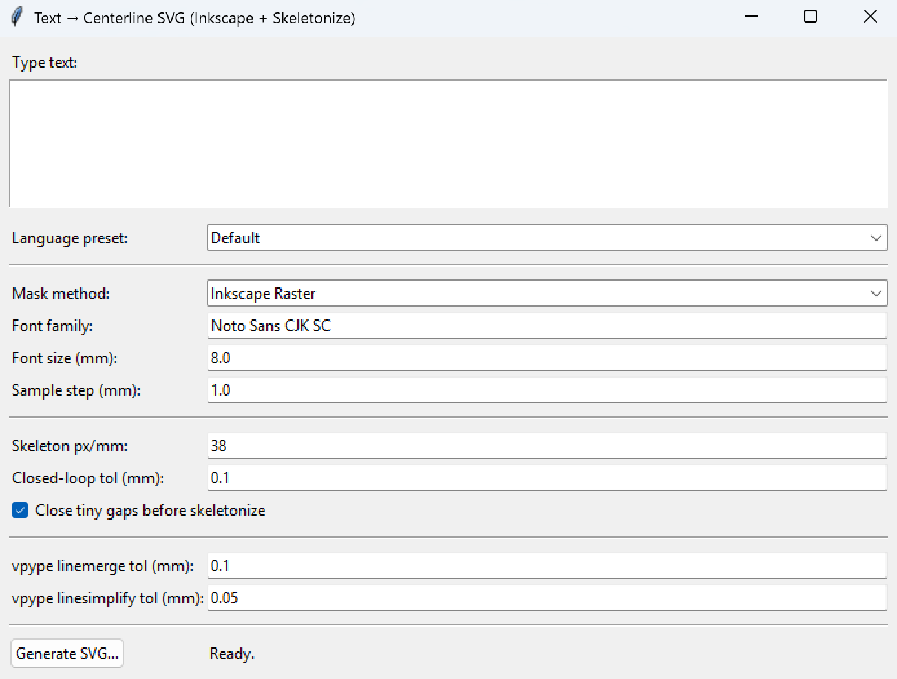

# AnyHershey

AnyHershey turns typed text into single-stroke SVG lines for a pen plotter or
cutter to draw. It works with any writing system you can type, in any font
installed on your computer. Presets tune it for Latin-script languages such as
English and Spanish, as well as Chinese, Japanese, Korean, Hindi-family and
Arabic text.



## Background

Regular fonts describe each character as a filled shape. A plotter given one of
these shapes traces its edge, so every stroke of a letter comes out as a thin
loop instead of a single line. Plotter users work around this with
single-stroke fonts, where each character is made of lines drawn once. The
best known are the Hershey fonts, designed by A. V. Hershey at the U.S. Naval
Weapons Laboratory in 1967. Hershey's fonts, like the single-stroke fonts made
since, cover only a small number of writing systems.

AnyHershey makes Hershey-style lines from a regular font. It finds the
centerline running down the middle of each filled stroke, so any font that can
display a script becomes a source of single-stroke text for that script. The
character shapes come from the font you choose. None of Hershey's original
fonts are used.

## Download and run (Windows)

1. Install [Inkscape](https://inkscape.org/). AnyHershey runs Inkscape in the
   background to lay out the text, so it will not work without it. It was
   developed with Inkscape 1.4.
2. Download the Windows zip from the
   [latest release](https://github.com/MarcDunand/Any-Hershey/releases).
3. Unzip it anywhere, then double-click `AnyHershey.exe`.

You don't need Python installed. If generating fails or hangs, Windows Firewall
may be blocking the background Inkscape process; allow Inkscape through the
firewall.

## Using AnyHershey

1. Type or paste text into the box. Line breaks are kept.
2. Pick the language preset that matches the text.
3. Press **Generate SVG** and choose where to save the file.

To try it, pick `Latin (English, Spanish, etc.)` and type a word. Then switch to
`Chinese (Simplified)` and paste `你好，世界` to see how it handles a logographic
script.

For text that mixes writing systems, start from the `Default` preset and adjust
the settings from there.

### Fonts

The font named in **Font family** must be installed on your computer so
Inkscape can use it. If Inkscape can't find the font, it falls back to its
default font, and the SVG comes out in that fallback font. AnyHershey checks
for the font before generating and warns you if it isn't installed.

Most preset fonts come with Windows: Arial, Microsoft YaHei, Microsoft
JhengHei, Yu Gothic, Malgun Gothic and Segoe UI. Two need installing:
[Kalam](https://fonts.google.com/specimen/Kalam) (Devanagari preset) and
[Noto Sans CJK SC](https://github.com/notofonts/noto-cjk) (Default preset).
See Microsoft's guide to
[installing fonts on Windows](https://support.microsoft.com/en-us/windows/manage-fonts-in-windows-f12d0657-2fc8-7613-c76f-88d043b334b8).

### Settings

| Setting | What it does |
| --- | --- |
| Language preset | Fills in the settings below with values tuned for one writing system. A preset only changes the settings it defines; the others keep their current values. |
| Mask method | How the character outlines become a filled image. See [How it works](#how-it-works). `Inkscape Raster` is the default. |
| Font family | The font Inkscape renders the text in. |
| Font size (mm) | Size of the text in the output, in millimeters. |
| Sample step (mm) | `XOR` mask method only. Spacing between the points taken along each outline. |
| Skeleton px/mm | Resolution of the image used to find centerlines. Higher values keep small details in dense characters but run slower. |
| Closed-loop tol (mm) | `XOR` mask method only. How close the two ends of an outline must be for it to count as a closed shape and get filled. |
| Close tiny gaps before skeletonize | Fills very small gaps and pinholes in the image before centerlines are found. |
| vpype linemerge tol (mm) | Lines whose ends are closer than this are joined into one line. |
| vpype linesimplify tol (mm) | Removes points that change a line's shape by less than this amount. |

## How it works

AnyHershey turns text into lines in five steps, all in
`anyhershey.py`. Two terms come up throughout: the **mask** is a
black-and-white image of the filled text, and the **skeleton** is the mask
thinned down to lines one pixel wide.

1. **Text to outlines.** AnyHershey writes the text into an SVG file and has
   Inkscape convert it to paths. Inkscape does the text layout, including
   scripts whose characters join (Arabic) or combine (Devanagari), so
   AnyHershey doesn't have to. The result is the filled outline of every
   character.
2. **Outlines to mask.** The outlines are turned into the mask, in one of two
   ways set by **Mask method**:
   - `Inkscape Raster` has Inkscape export the outlines as an image.
   - `XOR` samples points along each outline and fills the shapes itself. Each
     shape flips the pixels under it, so a shape inside another shape, such as
     the hole in an "o", is left empty.

   If **Close tiny gaps** is on, small breaks in the mask are filled next.
3. **Mask to skeleton.** scikit-image thins every filled stroke in the mask
   down to a one-pixel line along the middle of that stroke.
4. **Skeleton to lines.** AnyHershey traces the skeleton's pixels into lines.
   It starts at stroke ends and at junctions where strokes meet, then picks up
   closed loops, like the ring of an "o", which have no ends or junctions. At a
   junction, the trace continues onto whichever branch turns the least, which
   keeps strokes from zig-zagging. The traced lines are written to an SVG with
   millimeter units.
5. **Cleanup for plotting.** [vpype](https://github.com/abey79/vpype) joins
   lines whose ends touch, reorders the lines to cut down pen travel between
   them, then drops points that don't change a line's shape. If vpype fails,
   AnyHershey saves the SVG from step 4 instead and shows a warning.

## Language presets

| Preset | Font |
| --- | --- |
| Default | Noto Sans CJK SC |
| Latin (English, Spanish, etc.) | Arial |
| Chinese (Simplified) | Microsoft YaHei |
| Chinese (Traditional) | Microsoft JhengHei |
| Japanese (Kanji) | Yu Gothic |
| Japanese (Hiragana) | Yu Gothic |
| Japanese (Katakana) | Yu Gothic |
| Korean (Hangul) | Malgun Gothic |
| Hindi-family (Devanagari) | Kalam |
| Arabic (Modern Standard) | Segoe UI |

Each preset also sets the skeleton resolution and vpype tolerances for its
script. Dense scripts such as Chinese use a higher resolution and tighter
tolerances than Latin text. `LanguageFontChoices.svg` is the sheet used to
compare fonts for each script.

Presets are stored in `language_presets.json`. Edit that file to change a
preset or add one; its keys match the settings above (`font_family`,
`skel_px_per_mm`, `vp_linemerge_tol_mm` and so on). In the Windows release,
the file is at `AnyHershey/_internal/language_presets.json`.

## Running from source

Needs Windows, Python 3.11 and Inkscape.

```powershell
python -m venv venv
.\venv\Scripts\Activate.ps1
pip install -r requirements-win.txt
python .\anyhershey.py
```

`python .\test_vpype.py` checks that vpype works in the current environment.

The code also looks for Inkscape in the usual macOS and Linux install
locations, but AnyHershey has only been built and tested on Windows.

## Building the Windows app

```powershell
.\build_win.ps1
```

This builds the app with PyInstaller into `dist/AnyHershey/`, copies
`README_windows.txt` in next to the exe as `README.txt`, then zips the folder to
`dist/AnyHershey_windows.zip` for the GitHub release. Build output is
gitignored.

## Files

| File | Purpose |
| --- | --- |
| `anyhershey.py` | The whole app: pipeline and UI |
| `language_presets.json` | Language presets |
| `LanguageFontChoices.svg` | Font comparison sheet for each script |
| `requirements-win.txt` | Python dependencies |
| `build_win.ps1` | Windows build and release zip |
| `README_windows.txt` | Instructions included in the release zip |
| `test_vpype.py` | vpype smoke test |

## Limitations

- Only a Windows build is released, and Inkscape must be installed.
- Stroke order and direction come from how the skeleton is traced, not from how
  the character is handwritten.
- Where strokes cross or meet, the skeleton can bend or leave short spurs, so a
  junction may not match the font exactly.
- AnyHershey warns about a font that isn't installed, but not about an
  installed font that lacks some of the characters in the text. Inkscape draws
  those characters in another font without saying so. Check the output if a
  character looks wrong.
- Fonts added only to Inkscape's own fonts folder, not installed in Windows,
  can trigger the missing-font warning even though Inkscape can use them.
